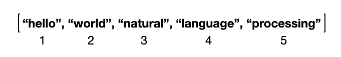
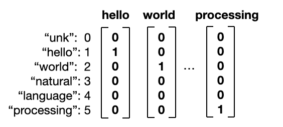
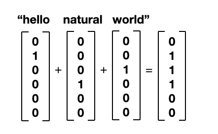

## NLP란?

Natural Language Processing (NLP) 로,

기계가 사람의 언어를 듣고, 말하고, 읽고, 쓰는것을 가능케 하는 AI 기술분야

> 개떡같이 말해도 찰떡같이 알아 들어야 진정한 AI


## BOW (Bag-of-words)

> 단어는 어떻게 숫자로 표현될 수 있나?

### 1. 아는 단어의 명단(Vocabulary)을 만든다.



### 2. 벡터 변환 (one hot vector)



### 3. 여러개의 단어 vector 를 합하여 문장으로 표현 (bag-of-words, BOW vector)



### 4. BoW vector : Nx1 매트릭스에 vocabulary 단어 빈도수 표시


### 5. Bow vector 문서 유사도

- d1 : the best Italian restaurant enjoy the best pasta
- d2 : American restaurant enjoy the best hamburger
- d3 : Korean restaurant enjoy the best bibimbap
- d4 : the best the best American restaurant

|      | American | best | bibimbap | enjoy | hamburger | italian | korean | pasta | restaurant | the  |
| ---- | :------: | :--: | :------: | :---: | :-------: | :-----: | :----: | :---: | ---------- | ---- |
| d1   |    0     |  2   |    0     |   1   |     0     |    1    |   0    |   1   | 1          | 2    |
| d2   |    1     |  1   |    0     |   1   |     1     |    0    |   0    |   0   | 1          | 1    |
| d3   |    0     |  1   |    1     |   1   |     0     |    0    |   1    |   0   | 1          | 1    |
| d4   |    1     |  2   |    0     |   0   |     0     |    0    |   0    |   0   | 1          | 2    |

|      | Document                                         | Cosine similarity with d4 |
| ---- | ------------------------------------------------ | ------------------------- |
| D1   | the best Italian restaurant enjoy the best pasta | **0.82**                  |
| D2   | American restaurant enjoy the best hamburger     | 0.77                      |
| D3   | Korean restaurant enjoy the best bibimbap        | 0.65                      |
| D4   | the best the best American restaurant            | 1                         |

```python
from sklearn.feature_extraction.text import CountVectorizer  
import numpy as np  
  
# 학습데이터  
training_documents =  
["the best Italian restaurant enjoy the best pasta",  
 "American restaurant enjoy the best hamburger",  
 "Korean restaurant enjoy the best bibimbap",  
 "the best the best American restaurant"]  
  
# CountVectorizer 객체  
bow_vectorizer = CountVectorizer()  
bow_vector = bow_vectorizer.fit_transform(training_documents)  
#print(bow2_vector.toarray())  
  
# cosine 유사도 함수  
def cosine_similarity(vector1, vector2):  
 vector1 = np.array(vector1)  
 vector2 = np.array(vector2)  
 return np.dot(vector1, vector2) / (np.sqrt(np.sum(vector1**2)) * np.sqrt(np.sum(vector2**2)))  
  
# d0,d1,d2,d3 와 d3 vector 간 cosine 유사도 측정  
for i in range(bow_vector.shape[0]):  
  print("d",i,"- d 3 cosine 유사도 :",cosine_similarity(bow_vector.toarray()[i], bow_vector.toarray()[3]))
   
```

<pre>
< 출력결과 >  
d 0 - d 3 cosine 유사도 : 0.8215838362577491  
d 1 - d 3 cosine 유사도 : 0.7745966692414834  
d 2 - d 3 cosine 유사도 : 0.6454972243679029  
d 3 - d 3 cosine 유사도 : 0.9999999999999998   
</pre>


### 6. TF-IDF vector 문서 유사도

> 중요도가 낮은 단어는 패널티(penalty)를 부과하자!

- TF : Term Frequency
- IDF : Inverse Document Frequency

| Document                                         | TF-IDF Bag og Words                       | Cosine similarity with d4 |
| ------------------------------------------------ | ----------------------------------------- | :-----------------------: |
| the best Italian restaurant enjoy the best pasta | [0.075, 0, 0.016, 0,0, 0.075, 0, 0, 0, 0] |             0             |
| American restaurant enjoy the best hamburger     | [0, 0, 0.02, 0, 0, 0, 0, 0.05, 0.1, 0, 0] |            0.5            |
| Korean restaurant enjoy the best bibimbap        | [0, 0, 0.02, 0, 0, 0, 0, 0, 0.1, 0.1]     |             0             |
| the best the best American restaurant            | [0, 0, 0, 0, 0, 0.05, 0, 0, 0]            |             1             |

```python
from sklearn.feature_extraction.text import TfidfVectorizer  
import numpy as np  
  
text = ['the best Italian restaurant enjoy the best pasta',  
        'American restaurant enjoy the best hamburger',  
        'Korean restaurant enjoy the best bibimbap',  
        'the best the best American restaurant']  
tfidf_vectorizer = TfidfVectorizer()  
  
def cosine_similarity(vector1, vector2):  
 vector1 = np.array(vector1)  
 vector2 = np.array(vector2)  
 return np.dot(vector1, vector2) / (np.sqrt(np.sum(vector1**2)) * np.sqrt(np.sum(vector2**2)))  
  
bow_vector = tfidf_vectorizer.fit_transform(text)  
  
for i in range(bow_vector.shape[0]):  
  print("d",i,"- d 3 cosine 유사도 :",cosine_similarity(bow_vector.toarray()[i], bow_vector.toarray()[3]))  
```

<pre>
< 출력결과 >  
d 0 - d 3 cosine 유사도 : 0.6343595536423782  
d 1 - d 3 cosine 유사도 : 0.6706654455485332  
d 2 - d 3 cosine 유사도 : 0.4325954627077376  
d 3 - d 3 cosine 유사도 : 1.0    
</pre>


### 7. BOW , TF-IDF 결함

- Vocabulary 기준 단어만 비교하지, 유의어, 단어순서는 비교 못함

  ```python
  from sklearn.feature_extraction.text import TfidfVectorizer
  import numpy as np
  
  text = ['American restaurant menu',
          'American restaurant menu hamberger pizza',
          'hamberger pizza']
  tfidf_vectorizer = TfidfVectorizer()
  
  bow_vector = tfidf_vectorizer.fit_transform(text)
  
  def cosine_similarity(vector1, vector2):  
   vector1 = np.array(vector1)  
   vector2 = np.array(vector2)  
   return np.dot(vector1, vector2) / (np.sqrt(np.sum(vector1**2)) * np.sqrt(np.sum(vector2**2)))  
  
  for i in range(bow_vector.shape[0]):
    print("d",i,"- d 2 cosine 유사도 :",cosine_similarity(bow_vector.toarray()[i], bow_vector.toarray()[2]))
  ```

  <pre>
  < 출력결과 >
  d 0 - d 2 cosine 유사도 : 0.0
  d 1 - d 2 cosine 유사도 : 0.632455532033676
  d 2 - d 2 cosine 유사도 : 1.0000000000000002
  </pre>
  

- 결함 개선 방안

  LSA (Latent Semantic Analysis)

  Word Embeddings (Word2Vec, Glove)

  ConceptNet