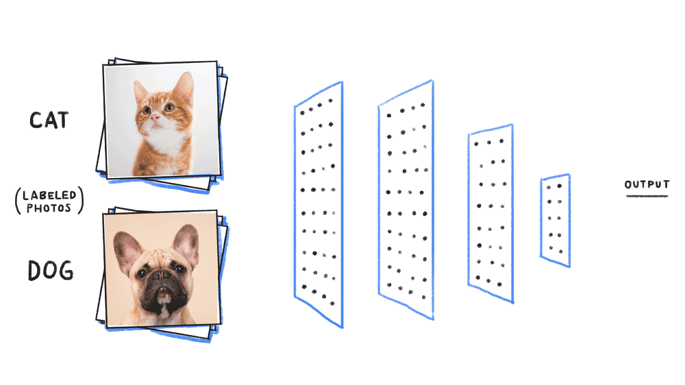
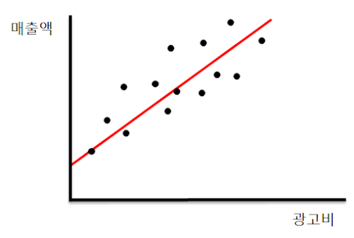
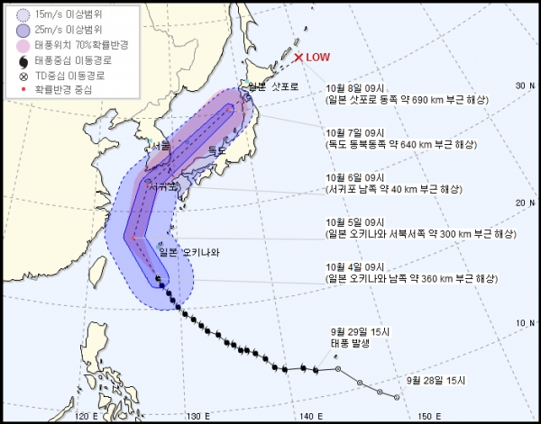
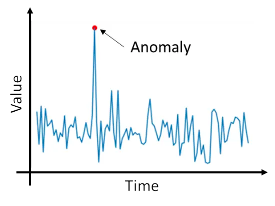
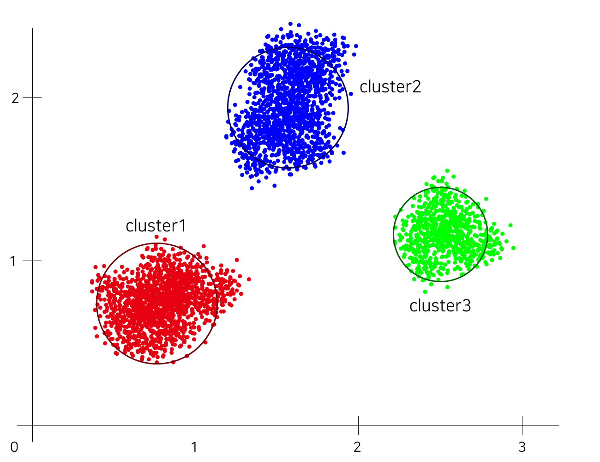
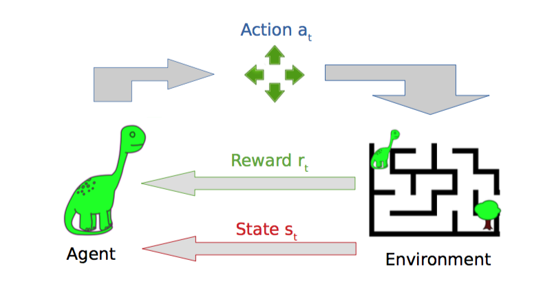

## Machine Learning 종류 및 알고리즘

### 1. 머신러닝 종류

| 지도학습                             | 비지도학습                     | 강화학습              |
| ------------------------------------ | ------------------------------ | --------------------- |
| Classification, Regression, Forecast | Anormaly Detection, Clustering | Reinforement Learning |

### (1) Classification (분류)

> 동물 사진 분류
>
> 뉴스 기사 분류 (사회 / 경제 / 정치)
>
> 손글씨 숫자 이미지 분류

### (2) Regression (회귀)

> 광고비에 따른 매출액
>
> 웹사이트 방문 수에 따른 구매 비율

### (3) Forecast (예측) : Regression + Time

> 이번주말 미세먼지 농도
>
> 태풍 예상 경로

### (4) Anomaly Detection (이상값 감지)

> 신용카드 이상 사용 감지
>
> 지진 감지

### (5) Clustering (그룹화)

> 비슷한 장르 영화 분류 (스릴러 / 액션 / 코미디)
>
> 백화점 고객 분류 (사용금액 / 방문횟수)
>
> SNS 의 친구 추천

### (6) Reinforcement Learning (강화학습)

> 게임
>
> 자율주행

### 2. 머신러닝 알고리즘

| 지도학습                                                     | 비지도학습                          | 강화학습                                               |
| ------------------------------------------------------------ | ----------------------------------- | ------------------------------------------------------ |
| - SVM - Logistic Regression - Linear Regression - Decision Tree - Random Forest - kNN - Neural networks | - K-means - PCA - Apriori | - Monte-Carlo - Q-learning - Markov Decision |

- 추천사이트

  https://machinelearningmastery.com/a-tour-of-machine-learning-algorithms/

  https://www.analyticsvidhya.com/blog/2017/09/common-machine-learning-algorithms/

  