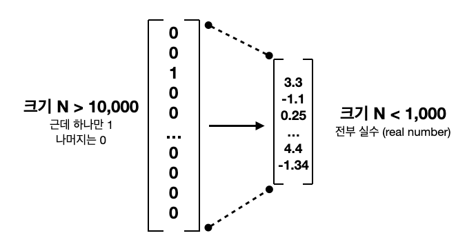

## King - Man + Woman = ?

> 단어간의 관계가 Vector 화 되있다면 풀수 있는 문제 


## Word Embedding (word vector)

단어간의 관계를 학습해 vector에 저장하는 모델

일종의 unsupervised learning방식이며 단어는 주변단어들에 의해 정의된다는 'Distributonal Hyphthesis 가설'에 기반

> (ex) The baby is crawling on the mat





One-hot vectors 는 bow 의 단어 frequency 를 숫자로만 표현하여 차원이 엄청 커질수 있고,

단어간의 관계를 벡터화 하지 못하는 반면에,

위 그림처럼 차원을 줄이면서 단어간의 관계를 내포하는 벡터로 표현하면 

"King - Man + Woman" 같은 문제도 풀수 있다.


## Word Embedding 알고리즘 종류

1. Glove

   문장에 한 단어가 어떤 근처 단어들과 몇 번 같이 나오는지 세보는 것(co-occurence matrix를 만듬) 

   단어가 많아지면서 Matrix크기가 엄청 커져버리는데 이 때 SVD알고리즘(PCA 유사)을 사용하여 Matrix의 차원을 축소시킴

2. word2vec

   neural network를 사용한 분류문제 해결을 기반으로 하여 단어간의 관계를 파악하는 알고리즘

   * CBOW : 주변 단어들을 모두 합쳐서 이를 바탕으로 타겟 단어를 맞추는 방법
   * Skipgram : 타겟 단어를 보고 주변 단어를 맞추기(CBOW와는 반대방식 느낌!)


## Word2Vec 실습

CBOW(Continuous-BOW) 모델로 학습

```python
import re
from lxml import etree
import urllib.request
import zipfile
from nltk.tokenize import word_tokenize, sent_tokenize
import nltk
from gensim.models import Word2Vec
from gensim.models import KeyedVectors


# 데이터 다운로드
urllib.request.urlretrieve("https://wit3.fbk.eu/get.php?path=XML_releases/xml/ted_en-20160408.zip&filename=ted_en-20160408.zip", filename="ted_en-20160408.zip")

# xml 파일로부터 <content>와 </content> 사이의 내용만 가져온다.
with zipfile.ZipFile('ted_en-20160408.zip', 'r') as z:
  target_text = etree.parse(z.open('ted_en-20160408.xml', 'r'))
  parse_text = '\n'.join(target_text.xpath('//content/text()'))

#print(parse_text[:300])

# 정규 표현식의 sub 모듈을 통해 content 중간에 등장하는 (Audio), (Laughter) 등의 배경음 부분을 제거.
# 해당 코드는 괄호로 구성된 내용을 제거.
content_text = re.sub(r'\([^)]*\)', '', parse_text)

# 입력 코퍼스에 대해서 NLTK를 이용하여 문장 토큰화를 수행.
sent_text=sent_tokenize(content_text)

# 각 문장에 대해서 구두점을 제거하고, 대문자를 소문자로 변환.
normalized_text = []
for string in sent_text:
     tokens = re.sub(r"[^a-z0-9]+", " ", string.lower())
     normalized_text.append(tokens)

# 각 문장에 대해서 NLTK를 이용하여 단어 토큰화를 수행.
nltk.download('punkt')
result = [word_tokenize(sentence) for sentence in normalized_text]

print('총 샘플의 개수 : {}'.format(len(result)))

# 샘플 3개만 출력
#for line in result[:3]:
#    print(line)


# size = 워드 벡터의 특징 값. 즉, 임베딩 된 벡터의 차원.
# window = 컨텍스트 윈도우 크기
# min_count = 단어 최소 빈도 수 제한 (빈도가 적은 단어들은 학습하지 않는다.)
# workers = 학습을 위한 프로세스 수
# sg = 0은 CBOW, 1은 Skip-gram.
model = Word2Vec(sentences=result, size=100, window=5, min_count=5, workers=4, sg=1)

model_result = model.wv.most_similar("man")

# 모델 저장
model.wv.save_word2vec_format('eng_w2v_sgram.bin')

# 모델 로드
loaded_model = KeyedVectors.load_word2vec_format("eng_w2v_sgram.bin") 
model_result = loaded_model.most_similar("man")
print(model_result)
```

<pre>
< 출력결과 >  
총 샘플의 개수 : 273424
[('guy', 0.7609226703643799), ('woman', 0.7423288226127625), ('soldier', 0.7021040916442871), ('rabbi', 0.6968523263931274), ('boy', 0.682236909866333), ('pianist', 0.6789600849151611), ('michelangelo', 0.6754906177520752), ('dancer', 0.6748736500740051), ('gentleman', 0.6688764691352844), ('comedian', 0.6668947339057922)]
</pre>


> ### King - Woman + Man 의 정답은?

<pre>
# python
>>> from gensim.models import word2vec
>>> from gensim.models import KeyedVectors
>>> loaded_model = KeyedVectors.load_word2vec_format("eng_w2v_sgram.bin")
>>> loaded_model.most_similar(positive=["king","woman"],negative=["man"])
[('queen', 0.6399722695350647), ('luther', 0.6368300914764404), ('jewish', 0.6324093341827393), ('mahatma', 0.6255710124969482), ('royal', 0.621810793876648), ('republican', 0.6188339591026306), ('agnes', 0.6142123937606812), ('mutilation', 0.6140838861465454), ('charlotte', 0.6131534576416016), ('donnell', 0.6124670505523682)]
</pre>

