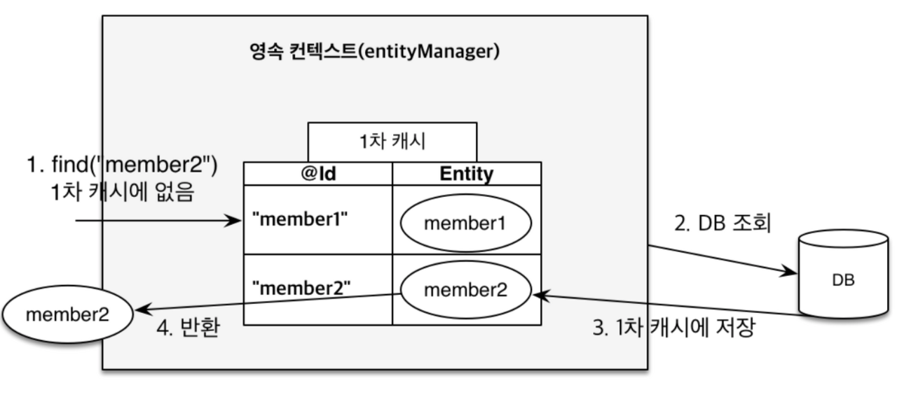
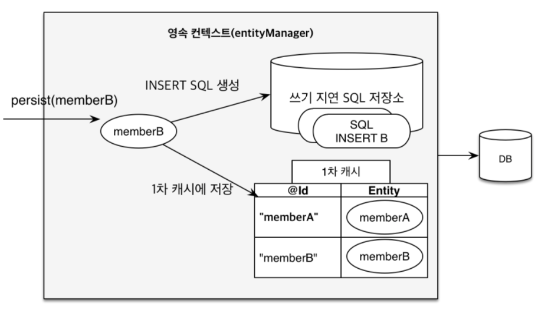
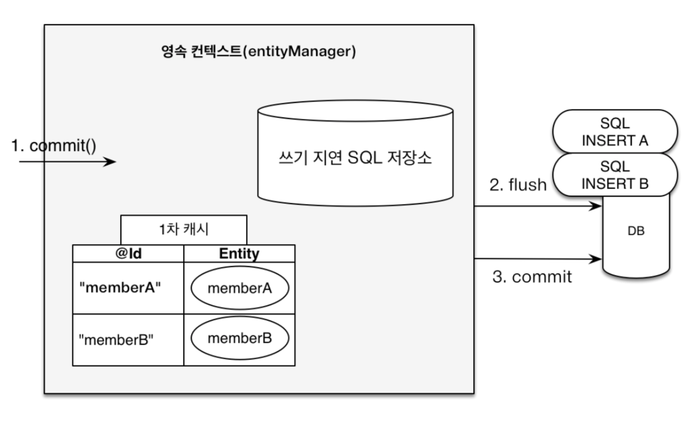
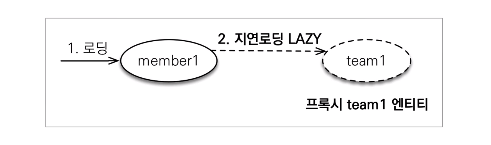
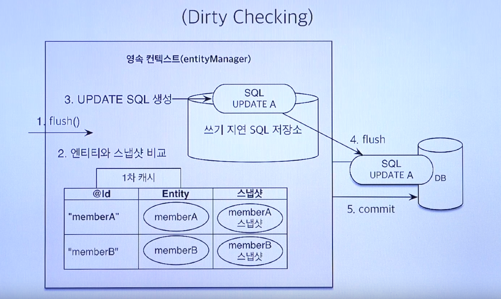

## 영속성 컨텍스트

> 엔티티를 영구 저장하는 환경
>
> 엔티티 매니저를 통해 엔티티를 저장하거나 조회하면 엔티티 매니저는 영속성 컨텍스트에 엔티티를 보관하고 관리한다.

#### 1. 1차 캐시



#### 2. 쓰기 지연





#### 3. 로딩 지연



#### 4. 변경 감지 (Dirty Checking)




## Transcation Commit, JPA flush

> @Transaction 설정 없이 엔티티를 영속성 컨텍스트에서 가져와, 엔티티를 수정를 수정한 후,
>
> 메소드가 종료되면 데이터베이스에 반영이 될까?

결론 : Select 쿼리만 발생하고, 업데이트 쿼리를 발생하지 않음


## Flush

> Flush : 영속성 컨텍스트의 변경 내용을 데이터베이스에 반영 (Sync)

#### 1. 플러시의 흐름

- 변경감지가 동작해서 수정된 엔티티를 찾는다
- 수정된 엔티티에 대해서 수정쿼리를 만들거나 SQL 저장소에 등록한다
- 쓰기 지연 SQL 저장소의 쿼리를 데이터베이스에 전송한다

#### 2. 플러시하는 방법

- em.flush()
- 트랜잭션 커밋시 자동 호출
- JPQL 쿼리 실행시 자동 호출


## JPARepository save

> 수정시는 가급적 dirty checking 으로 DB 업데이트 하라 !!

```java
@Transactional 
@Override public <S extends T> S save(S entity) { 
  if (entityInformation.isNew(entity)) { 
    em.persist(entity); return entity; } 
  else { 
    S result = em.merge(entity); 
    return result;
  }
}
```


## 연관관계 맵핑

> 수정시는 가급적 dirty checking 으로 DB 업데이트 하라 !!